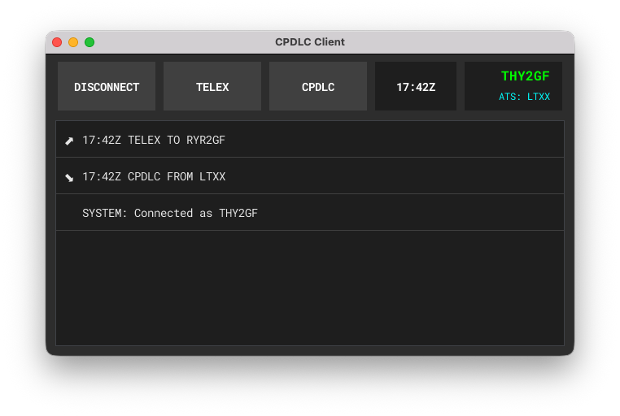

# Java CPDLC
Java CPDLC is a multi-platform CPDLC Client for HoppieAcars. 
It is written on Java so you can use it on any platform (Windows/Linux/macOS).

## Notes
- For any feedback please contact me with mail: thmsacar@gmail.com
- Currently, CPDLC reports cannot be sent as I have not yet implemented this feature totally. However, all other types of messages can be fetched and replied. Requests can be sent without problem.
## Important Note on Java 8
- Java CPDLC is coded on Java 8 (Java SDK 1.8) as I wanted it to be compatible on as many machine as possible. Therefore, it does not use HTTP Client, which was released after Java 11. Take this into account during compilation.

## Usage
1. Once compiled and run, you should have a login page. You need to put in your callsign and Hoppie ID. Click SAVE button
2. Thereafter, everything should be pretty straight forward.

- If your callsign is in green color, the connection with Hoppie server has established.
- If any connection problem occurs your callsign will become red.

## Contribution
As of now, the code doesn't have javadoc so it's a bit of mess. I will for sure write javadoc and necessary comments to the code. 

However, any pull requests are still welcome. See below what I am currently working on. 

#### Features to implement
- Send CPDLC reports
- Send When can we? request
- Clean the code and structure

